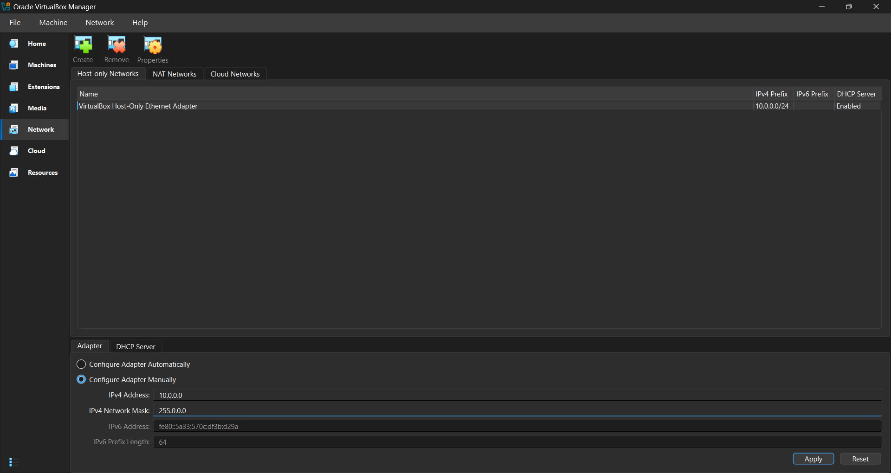
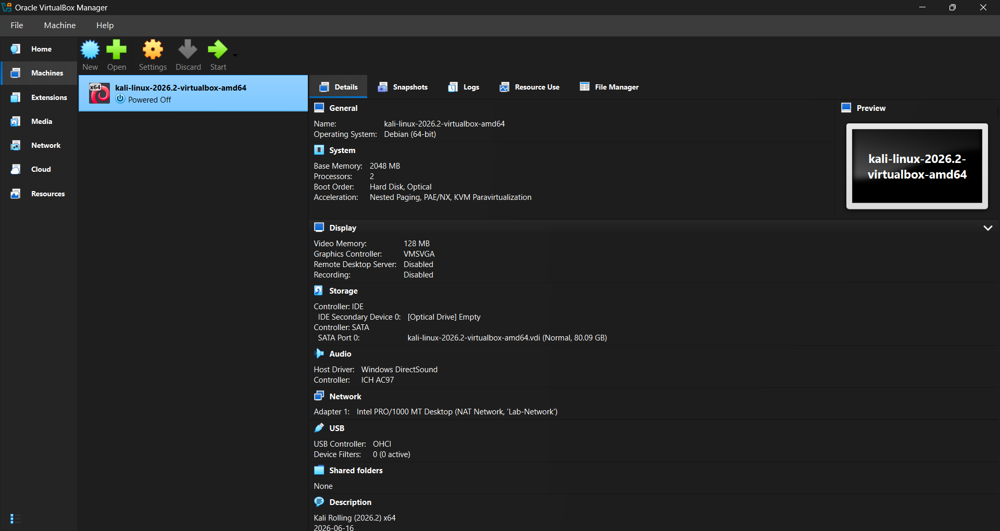
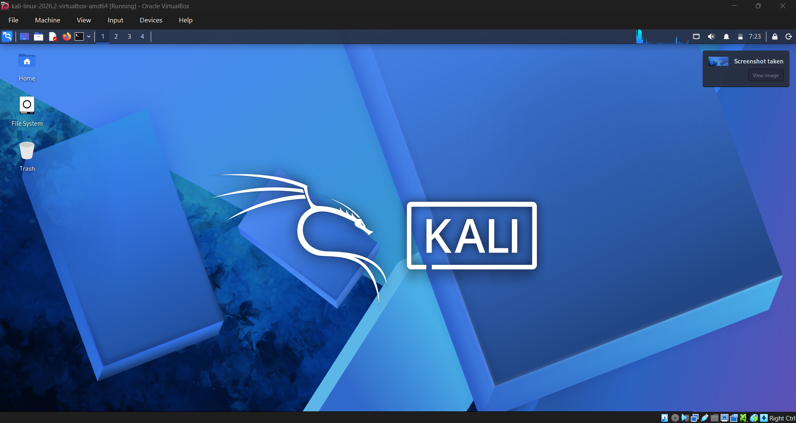
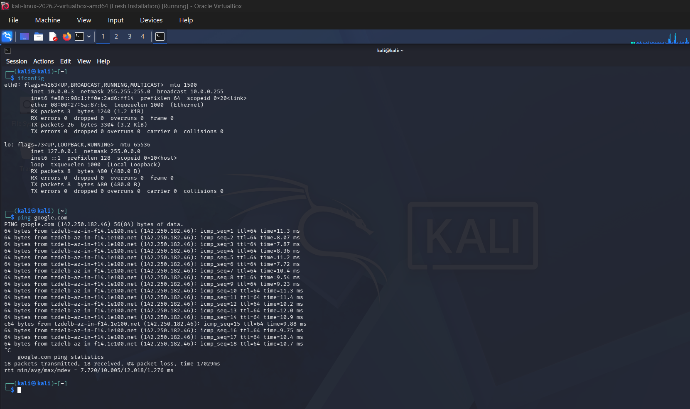

# 🐉 Kali Linux Lab Setup

> **A practical Kali Linux security lab built with Oracle VirtualBox and a dedicated NAT Network.**

This repository documents the complete setup of a **Kali Linux lab environment** using **Oracle VirtualBox**.

The lab is designed to provide an isolated and reproducible environment for learning **cybersecurity, penetration testing, networking, and security tools** without modifying the host operating system.

---

## 📋 Table of Contents

* [Lab Overview](#-lab-overview)
* [Lab Architecture](#️-lab-architecture)
* [Prerequisites](#-prerequisites)
* [Step 1 — NAT Network Setup](#1--nat-network-setup)
* [Step 2 — Kali Linux Setup](#2--kali-linux-setup)
* [Step 3 — Kali Network Configuration](#3--kali-network-configuration)
* [Step 4 — Kali Snapshots](#4--kali-snapshots)
* [Network Verification](#-network-verification)
* [Final Lab Configuration](#-final-lab-configuration)
* [Troubleshooting](#-troubleshooting)
* [Next Steps](#-next-steps)

---

# 🔎 Lab Overview

The lab consists of a Kali Linux virtual machine connected to a custom VirtualBox **NAT Network**.

### ⚙️ Configuration

| Component           | Configuration     |
| ------------------- | ----------------- |
| 🖥️ Hypervisor      | Oracle VirtualBox |
| 🐉 Operating System | Kali Linux 2026.2 |
| 💻 Architecture     | x64               |
| 🌐 Network Type     | NAT Network       |
| 🔌 Network Name     | `Lab-Network`     |
| 📡 Network          | `10.0.0.0/24`     |
| 🚪 Gateway          | `10.0.0.1`        |
| 📦 DHCP             | Enabled           |
| 🖥️ Kali IP         | `10.0.0.3`        |
| 🧠 RAM              | 2048 MB           |
| ⚙️ CPUs             | 2                 |
| 💾 Disk             | ~80 GB            |

> **Note:** The Kali IP address may change when DHCP is used. `10.0.0.3` is the address observed in this lab configuration.

---

# 🗺️ Lab Architecture

```text
                         🌐 Internet
                              │
                              │
                    ┌─────────▼─────────┐
                    │   Host Machine    │
                    │      Windows      │
                    └─────────┬─────────┘
                              │
                              │
                    ┌─────────▼─────────┐
                    │    VirtualBox     │
                    │    NAT Network    │
                    │    Lab-Network    │
                    │   10.0.0.0/24     │
                    └─────────┬─────────┘
                              │
                              │
                    ┌─────────▼─────────┐
                    │    🐉 Kali Linux   │
                    │     10.0.0.3      │
                    │                   │
                    │   Gateway:        │
                    │     10.0.0.1      │
                    └───────────────────┘
```

The NAT Network provides:

* 🌐 Internet connectivity
* 🔄 Communication between lab VMs
* 🛡️ Separation from the physical LAN
* 🧪 A controlled environment for security testing

---

# 🛠️ Prerequisites

Before starting, make sure you have:

* [ ] A Windows/Linux/macOS host machine
* [ ] Oracle VirtualBox installed
* [ ] Kali Linux VirtualBox image or ISO
* [ ] At least **4 GB RAM** available for the VM and host
* [ ] At least **80 GB free disk space**
* [ ] Hardware virtualization enabled in BIOS/UEFI
* [ ] Basic familiarity with Linux terminal commands

---

# 1 · 🌐 NAT Network Setup

The first step is to create a dedicated NAT Network for the lab.

## Create the NAT Network

Open **Oracle VirtualBox Manager**.

Navigate to:

```text
Network → NAT Networks
```

Create a new NAT Network with:

```text
Name:          Lab-Network
IPv4 Prefix:   10.0.0.0/24
DHCP:          Enabled
```

### 📸 NAT Network Configuration



The resulting configuration should provide a network similar to:

```text
┌─────────────────────────────────────┐
│           Lab-Network               │
├─────────────────────────────────────┤
│ Network:     10.0.0.0/24            │
│ Gateway:     10.0.0.1               │
│ DHCP:        Enabled                │
└─────────────────────────────────────┘
```

## 💡 Why NAT Network?

A NAT Network is useful for a cybersecurity lab because it allows multiple virtual machines to communicate while still providing internet access.

For example:

```text
                 🌐 Internet
                      │
                VirtualBox NAT
                      │
              ┌───────┴───────┐
              │               │
          🐉 Kali VM       🎯 Target VM
          10.0.0.3          10.0.0.x
              │               │
              └───────┬───────┘
                      │
                Lab-Network
                10.0.0.0/24
```

> ⚠️ **Important:** Use **NAT Network**, not regular **NAT**, if you want multiple lab VMs to communicate with each other.

---

# 2 · 🐉 Kali Linux Setup

## Create or Import the Kali VM

Create a new virtual machine or import the Kali Linux VirtualBox image.

Recommended configuration:

```text
Name:        kali-linux-2026.2-virtualbox-amd64
OS Type:     Debian (64-bit)
Memory:      2048 MB
Processors:  2
Disk:        ~80 GB
```

### 📸 Kali VM Configuration




---

## Configure the Network Adapter

Open:

```text
Kali VM
   ↓
Settings
   ↓
Network
   ↓
Adapter 1
```

Configure the adapter as:

```text
Enable Network Adapter:  ✓
Attached to:             NAT Network
Name:                    Lab-Network
```

The final configuration should look like:

```text
Adapter 1
    │
    └── NAT Network
            │
            └── Lab-Network
```

Start the Kali VM after completing the configuration.

---

# 3 · 🔌 Kali Network Configuration

After Kali Linux starts, open a terminal.

---

## Check the Network Interface

Run:

```bash
ip addr
```

or:

```bash
ip -4 addr
```

Look for an Ethernet interface such as:

```text
eth0
```

or:

```text
enp0s3
```

---

## Check the IP Address

Run:

```bash
ip addr
```

Kali should receive an address from:

```text
10.0.0.0/24
```

In this lab, the observed address is:

```text
10.0.0.3
```

---

## Check the Default Gateway

Run:

```bash
ip route
```

You should see a route similar to:

```text
default via 10.0.0.1
```

This confirms that Kali is using the VirtualBox NAT Network gateway.

---

## Check DNS

Run:

```bash
cat /etc/resolv.conf
```

A working DNS server should be configured.

The DNS server observed in this setup is:

```text
192.168.1.1
```

> **Note:** DNS configuration can vary depending on the host network and VirtualBox configuration.

---

# 🧪 Network Verification

After configuring the network, verify connectivity in three stages.

## 1. Test the Gateway

```bash
ping -c 4 10.0.0.1
```

Expected:

```text
Gateway connectivity ✓
```

---

## 2. Test Internet Connectivity

```bash
ping -c 4 8.8.8.8
```

Expected:

```text
Internet connectivity ✓
```

---

## 3. Test DNS Resolution

```bash
ping -c 4 google.com
```

Expected:

```text
DNS resolution ✓
```

---




## 🔍 Quick Verification Commands

Run:

```bash
ip addr
ip route
cat /etc/resolv.conf
```

Expected configuration:

```text
┌─────────────────────────────────────┐
│       Kali Network Configuration    │
├─────────────────────────────────────┤
│ IP Address : 10.0.0.3               │
│ Network    : 10.0.0.0/24            │
│ Gateway    : 10.0.0.1               │
│ DNS        : 192.168.1.1            │
└─────────────────────────────────────┘
```

---

# 4 · 📸 Kali Snapshots

Snapshots are extremely useful when working with a cybersecurity lab.

Before experimenting with tools, network configurations, or vulnerable applications, create a snapshot so that you can quickly return to a known-good state.

---

## Create the Baseline Snapshot

Once Kali is completely configured:

1. Shut down Kali cleanly.
2. Open **Oracle VirtualBox Manager**.
3. Select the Kali VM.
4. Open **Snapshots**.
5. Create a new snapshot.

Use the following name:

```text
Fresh Installation
```

Recommended description:

```text
Clean Kali Linux installation with Lab-Network configured
and network connectivity verified.
```

### 📸 Kali Snapshot


The snapshot structure should look similar to:

```text
📸 Fresh Installation
└── ▶ Current State
```

---

## 🔬 Recommended Snapshot Strategy

Create a snapshot before making major changes.

Example:

```text
📸 Fresh Installation
        │
        ├── 📸 Before Tool Installation
        │
        ├── 📸 Before Network Testing
        │
        └── 📸 Before Lab Exercise
```

Useful snapshot names include:

```text
Fresh Installation
Before Tool Installation
Before Network Configuration
Before Metasploit Lab
Before Network Testing
Clean Lab Baseline
```

---

## ♻️ Restore a Snapshot

If an experiment breaks the Kali environment:

1. Power off the VM.
2. Open **VirtualBox → Snapshots**.
3. Select the desired snapshot.
4. Click **Restore**.
5. Start Kali again.

Example:

```text
        🧪 Lab Experiment
               │
               ▼
          💥 Something
             breaks
               │
               ▼
       ♻️ Restore Snapshot
               │
               ▼
      🐉 Clean Kali System
```

---

# 📁 Repository Structure

A clean repository structure is recommended:

```text
kali-linux-lab/
│
├── README.md
│
└── images/
    │
    ├── 01-nat-setup.png
    ├── 02-kali-setup.png
    ├── 03-network-config.png
    └── 04-snapshots.png
```

The images are referenced in the README using relative paths:

```markdown

```

This allows GitHub to automatically render the images when viewing the README.

---

# ✅ Final Setup Checklist

## 🌐 NAT Network

* [ ] Create `Lab-Network`
* [ ] Configure `10.0.0.0/24`
* [ ] Enable DHCP
* [ ] Verify gateway `10.0.0.1`

## 🐉 Kali Linux

* [ ] Install/import Kali Linux
* [ ] Configure Adapter 1
* [ ] Attach Adapter 1 to `Lab-Network`
* [ ] Start Kali successfully

## 🔌 Network

* [ ] Verify Kali IP address
* [ ] Verify default gateway
* [ ] Verify DNS
* [ ] Ping `10.0.0.1`
* [ ] Ping `8.8.8.8`
* [ ] Test DNS with `google.com`

## 📸 Snapshots

* [ ] Shut down Kali
* [ ] Create `Fresh Installation`
* [ ] Add a useful description
* [ ] Create additional snapshots before major lab changes

---

# 🏁 Final Lab Configuration

Once everything is complete, the lab should look like this:

```text
                         🌐 INTERNET
                              │
                              ▼
                    ┌─────────────────┐
                    │   HOST MACHINE  │
                    └────────┬────────┘
                             │
                             ▼
                    ┌─────────────────┐
                    │    VirtualBox   │
                    │   NAT Network   │
                    └────────┬────────┘
                             │
                    ┌────────▼────────┐
                    │   Lab-Network   │
                    │   10.0.0.0/24   │
                    │                 │
                    │ Gateway         │
                    │ 10.0.0.1        │
                    └────────┬────────┘
                             │
                             ▼
                    ┌─────────────────┐
                    │   🐉 KALI LINUX  │
                    │                 │
                    │   10.0.0.3      │
                    └────────┬────────┘
                             │
                             ▼
                    📸 Fresh Installation
                       Snapshot
```

---

# 🚀 Next Steps

Once the base Kali environment is ready, the lab can be expanded with additional virtual machines.

Possible additions:

* 🎯 Vulnerable Linux targets
* 🪟 Windows test machines
* 🌐 Web application targets
* 🗄️ Database servers
* 🔐 Active Directory lab
* 🧪 Capture-the-Flag environments
* 🔎 Network monitoring tools
* 🛡️ Defensive security tools

The recommended approach is to keep the **Fresh Installation** snapshot untouched and create additional snapshots as the lab evolves.

---

## ⚠️ Responsible Use

This lab should be used only for **authorized security testing, education, and experimentation**.

Only test systems that you own or have explicit permission to assess.

---

## ⭐ Lab Status

```text
┌────────────────────────────────────────┐
│          🐉 KALI LAB STATUS            │
├────────────────────────────────────────┤
│                                        │
│  🌐 NAT Network       ✅ Configured    │
│  🐉 Kali Linux        ✅ Installed     │
│  🔌 Network           ✅ Verified      │
│  📸 Snapshot          ✅ Created       │
│                                        │
│  🚀 LAB READY                         │
│                                        │
└────────────────────────────────────────┘
```

> **Happy Learning & Stay Ethical! 🐉🔐**
